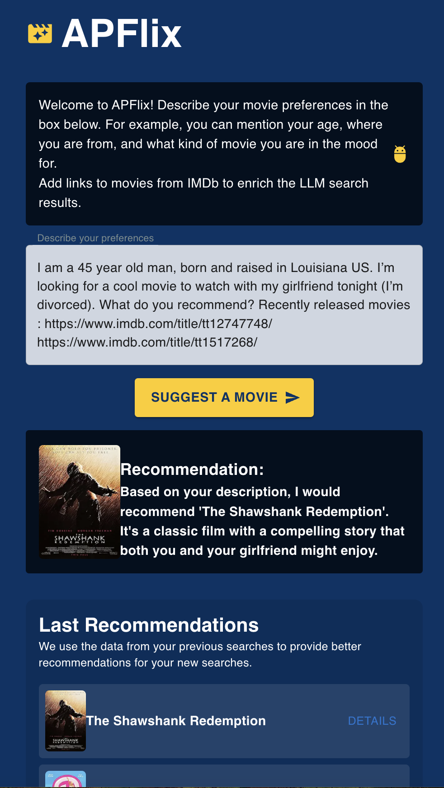

# APFLIX - by Tal Kerbis
Welcome to APFLIX! 

- Use it here - [link](http://www.talkerbis.com)

- Link to demo - [demo](https://app.storylane.io/share/1uozjpd96qh3)


APFLIX is a movie recommendation assistant that helps users find movies based on their preferences. Users can provide a description of what they're looking for and share IMDb links to movies they're interested in order to enrich the recommendations since the system holds pre defined data updated up to 2022.
More than that, user can overview the general history of recommendations.
The view is integrated with movie thumbnails from OMDB API.
The webApp fits both desktop and mobile devices.


## Table of Contents
- [Specifications](#Specifications)
- [Development](#Development)
- [Flow](#Flow)
   - [User Input Validation](#The-user-input-is-being-validated)
  - [Data Processing](#Data-Processing)
  - [Recommendations](#Recommendations)
  - [History](#History)
- [Security](#Security)
- [Deployment](#Deployment)
- [Improvements](#Improvements)
- [Screenshots](#Screenshots)

## Specifications
- Next.js - For FE and BE development
- AWS EC2 - For deployment
- LangChain - to compute recommendations and embeddings for data enrichment
- Playwright - for e2e UI testing
- MongoDB - for storing recommendations history

## Development
1. Clone the repository 
2. Fill the keys in `.env` for 
```bash
OPENAI_API_KEY=ADD_YOUR_OPEN_AI #For LLM recommendations
OMDB_API_KEY=ADD_YOUR_OMDB #For movie thumbnail
MONGODB_URI=ADD_YOUR_MONGODB #For storing recommendations history
```
3. Install the dependencies and run the project
```bash
npm install
npm run dev
```
go to http://localhost:3000

4. Testing
```bash
npm run test:e2e #for e2e testing
npm run test:unit #for unit testing
npm run allure #to open allure report
```


## Flow
- **First**, Users add their description and imdb links to movies they like, then submit.
- #### **The user input is being validated**:
    - Using prompt engineering techniques, we verify that the prompt is not harmful or malicious and that the user is not trying to exploit the system
    - Limits the number of characters in the description to prevent the user from sending too much data
    - If the validation fails, the system will display an error message to the user
- #### **Data processing**:
    - We extract the link using regex, store them and display it to the user
    - Using prompt engineering techniques and langchain, we wrap the user input description with a prompt that will guide the language model how to recommend movies based on the user's preferences - this prompt includes list of pre-defined movies and {context} placeholder for the new data(data from imdb links)
    - **In case the user provided links**:
        - We will use the html of the links provided and extract the movie title and description from the html
        - We will use the new data to add it to the pre-defined movie list.
        - its done by computing the embeddings of the new data and store its vectors using langchain
            - Split raw data to chunks(movie name and description)
            - Compute the embeddings for each chunk
            - Retrieve the embeddings and store them in the system
            - The relevant data will be injected to the prompt '{context}' and will be used to recommend movies
            - compute the recommendations via the language model based on the new data + the pre-defined data
    - **In case the user didn't provide links**, the system will recommend movies based on the description using its pre-defined movie list(past 2022)
- #### **Recommendations**:
    - Before return response to the user, we validate that the response was successful and that the user received the recommendations that match his preferences
    - Displays the recommendations to the user and attach the movie thumbnails from OMDB API
- #### **History**:
  - Store recommendations history in MongoDB.
  - Allow users to view and interact with the recommendation history, including movie thumbnails.

## Security
- Character limits on descriptions and responses to prevent excessive data.
- The system verifies that the user input is not harmful or malicious and that the user is not trying to exploit the system.
- The system verifies that the llm response was successful. To pervert cases where the user cause the system to return "bad" response by sending harmful data from the llm somehow.
- HTTPS protocol and AWS security groups for protection.


## Deployment
- to deploy, go inside the ec2 and run the following commands:
```bash
./deploy.sh
```
- The server is running using pm2 to ensure the server is up and running

## Improvements
- **User management**: for login\signup and personal recommendations and personal history 
- **Deployment and CI/CD**: Implement a CI/CD pipeline to automate the deployment process. 
- **Enhanced Security**: Verify that the URLs user provided are not malicious before the system will use those, it can be done by leveraging Google Safe Browsing API, its for cases that the user bypassed the prompt validation and injected malicious data in the links.
- **Using AWS parameter store for secrets**: For better security, the system should use AWS parameter store to store the secrets and not in the .env file/in the ec2 instance.
- **Integrate IMDB API**: Currently the movie data is being taken from the IMDB html. I would like to use the IMDB API to get the data in a more structured way and to avoid the need to parse the html which can be problematic.
- **Redis for history caching**: Currently the system stores the history in MongoDB. I would like to use Redis for caching the recommendations and the history to improve the performance.
- **Elastic DB for storing the embeddings**: Currently the system stores the embeddings in the memory. I would like to use Elastic DB to store the embeddings and to be able to scale the system. This way the system will be able to handle more data and more users. As the embedding will be stored in the Elastic DB, the system will be able to retrieve the embeddings faster.
- **Fine-Tuning**: Fine-tuning the language model on a specific dataset tailored to movie recommendations can significantly improve accuracy. The model will be trained on user descriptions and corresponding recommendations, enhancing its understanding of user preferences. This will lead to more accurate and personalized suggestions. Fine-tuning also boosts the model's performance and efficiency. As a result, users will experience faster and more relevant recommendations.
- **Improve response time**: optimize the data extraction using IMDB api and LLM processing to reduce the response time


## Screenshots


Thank you for using APFLIX! We hope you enjoy discovering new movies tailored to your tastes.